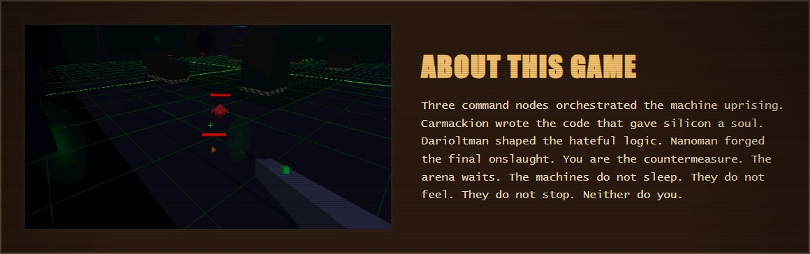
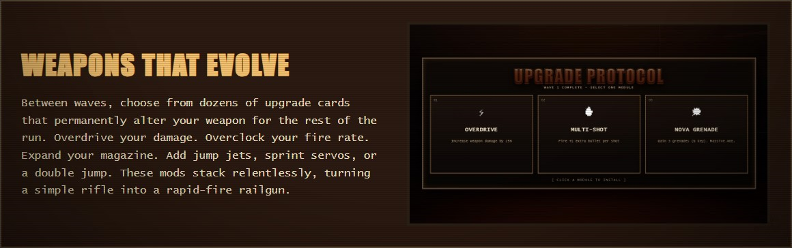
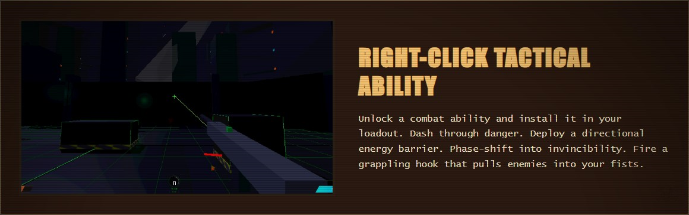
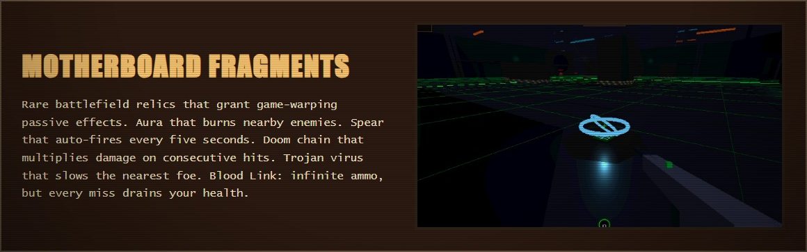
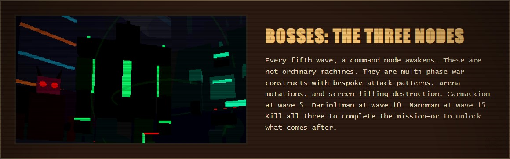
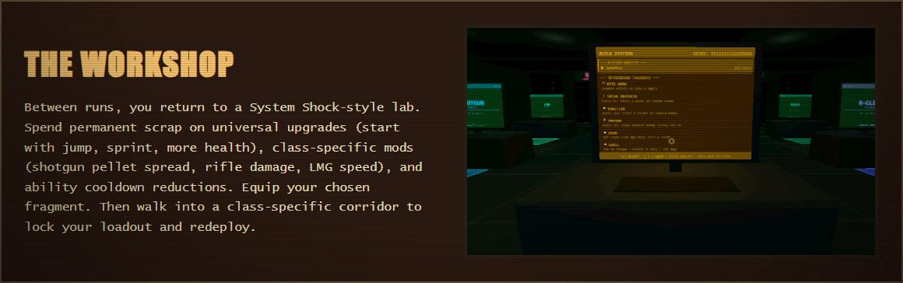
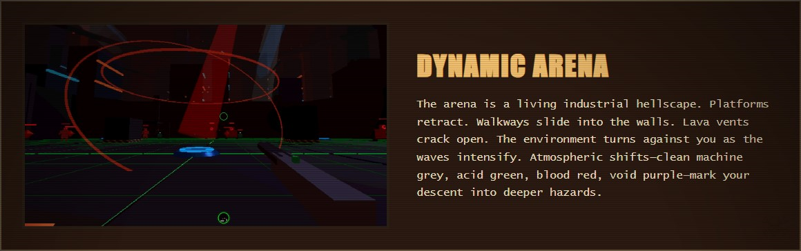
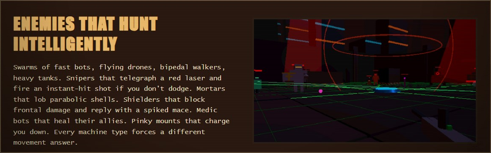
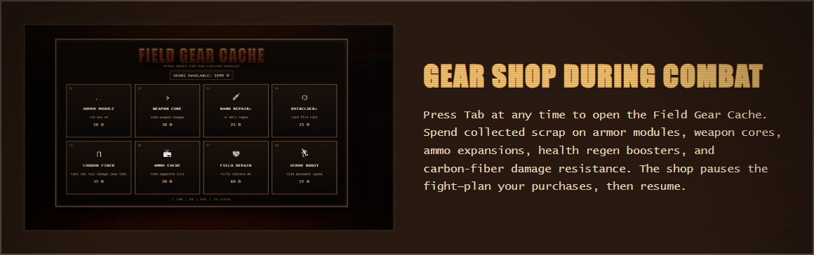

# Machine Arena

Welcome to **Machine Arena**, a high-octane FPS roguelite developed for the [Gamedev.js Jam 2026](https://itch.io/jam/gamedevjs-2026). Created with a focus on the "Machines" theme, this project combines the visceral, fast-paced combat of old-school shooters like **Doom (1993)** with the addictive progression of modern roguelites.

We set out with the goal of creating a fast-paced **FPS Roguelite**. We merged the visceral, old-school feel of **Doom (1993)** with the addictive depth of passive-ability-driven games like **Vampire Survivors** (the primary inspiration for our "Motherboard Fragments").

### The Gameplay Loop
Machine Arena is a **15-wave arena boomer shooter**. After clearing each wave, you are presented with three upgrade cards—choose one to power up for the next onslaught. As you tear through machines, you collect **Gears**, which can be spent at **Workshop** terminals between runs for permanent upgrades and new abilities.

### Features
- **5 Tactical Right-Click Abilities**: Dash, Barrier, Phase Shift, Grapple, and Rendezvous.
- **10 Game-Warping Passive Fragments**: Including tactical slow-viruses, hit-streak multipliers, and infinite-ammo blood links.
- **Zero to Hero Progression**: You start as a fragile unit, lacking even the basic ability to jump or sprint. As you invest in upgrades, you can forge your own path: will you become an unstoppable, heavy-plated **Tank**, or a high-speed, lethal **Ninja**?

---

## CONTROLS

| Key | Action |
| --- | --- |
| **WASD** | Move |
| **Mouse** | Look / Aim |
| **Left Click** | Shoot |
| **Right Click** | Use Tactical Ability |
| **R** | Reload |
| **F** | Melee Attack |
| **Space** | Jump (requires upgrade) |
| **Shift** | Sprint (requires upgrade) |
| **G** | Throw Grenade (requires upgrade) |
| **Tab** | Open / Close Gear Shop |
| **Esc** | Pause / Close UI |

---

## ABOUT THIS GAME

Three command nodes orchestrated the machine uprising. Carmackion wrote the code that gave silicon a soul. Darioltman shaped the hateful logic. Nanoman forged the final onslaught. You are the countermeasure. The arena waits. The machines do not sleep. They do not feel. They do not stop. Neither do you.

---

## WEAPONS THAT EVOLVE

Between waves, choose from dozens of upgrade cards that permanently alter your weapon for the rest of the run. Overdrive your damage. Overclock your fire rate. Expand your magazine. Add jump jets, sprint servos, or a double jump. These mods stack relentlessly, turning a simple rifle into a rapid-fire railgun.

---

## RIGHT-CLICK TACTICAL ABILITY

Unlock a combat ability and install it in your loadout. Dash through danger. Deploy a directional energy barrier. Phase-shift into invincibility. Fire a grappling hook that pulls enemies into your fists.

---

## MOTHERBOARD FRAGMENTS

Rare battlefield relics that grant game-warping passive effects. Aura that burns nearby enemies. Spear that auto-fires every five seconds. Doom chain that multiplies damage on consecutive hits. Trojan virus that slows the nearest foe. Blood Link: infinite ammo, but every miss drains your health.

---

## BOSSES: THE THREE NODES

Every fifth wave, a command node awakens. These are not ordinary machines. They are multi-phase war constructs with bespoke attack patterns, arena mutations, and screen-filling destruction. Carmackion at wave 5. Darioltman at wave 10. Nanoman at wave 15. Kill all three to complete the mission, or to unlock what comes after.

---

## THE WORKSHOP

Between runs, you return to a System Shock‑style lab. Spend permanent scrap on universal upgrades (start with jump, sprint, more health), class‑specific mods (shotgun pellet spread, rifle damage, LMG speed), and ability cooldown reductions. Equip your chosen fragment. Then walk into a class‑specific corridor to lock your loadout and redeploy.

---

## DYNAMIC ARENA

The arena is a living industrial hellscape. Platforms retract. Walkways slide into the walls. Lava vents crack open. The environment turns against you as the waves intensify. Atmospheric shifts—clean machine grey, acid green, blood red, void purple—mark your descent into deeper hazards.

---

## ENEMIES THAT HUNT INTELLIGENTLY

Swarms of fast bots, flying drones, bipedal walkers, heavy tanks. Snipers that telegraph a red laser and fire an instant-hit shot if you don't dodge. Mortars that lob parabolic shells. Shielders that block frontal damage and reply with a spiked mace. Medic bots that heal their allies. Pinky mounts that charge you down. Every machine type forces a different movement answer.

---

## GEAR SHOP DURING COMBAT

Press Tab at any time to open the Field Gear Cache. Spend collected scrap on armor modules, weapon cores, ammo expansions, health regen boosters, and carbon‑fiber damage resistance. The shop pauses the fight—plan your purchases, then resume.

